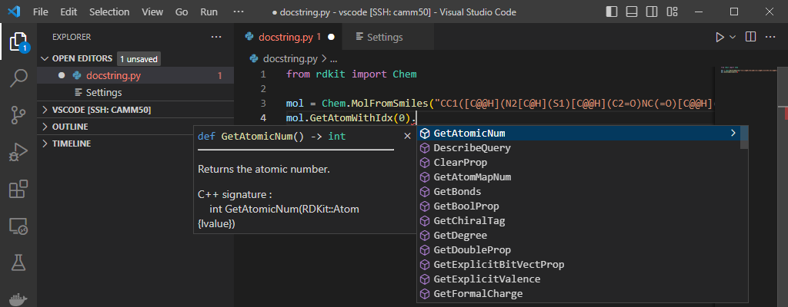
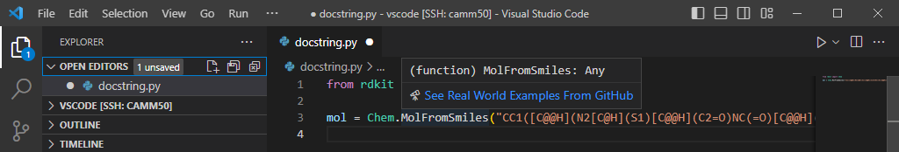
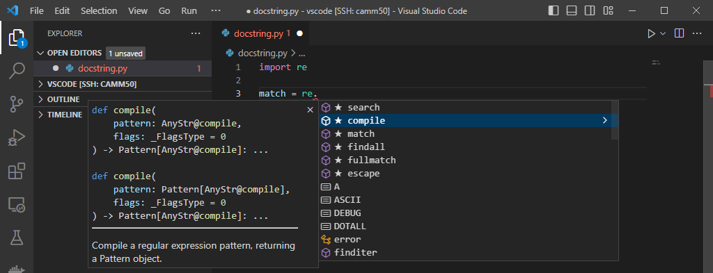
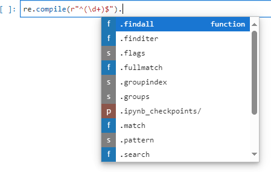
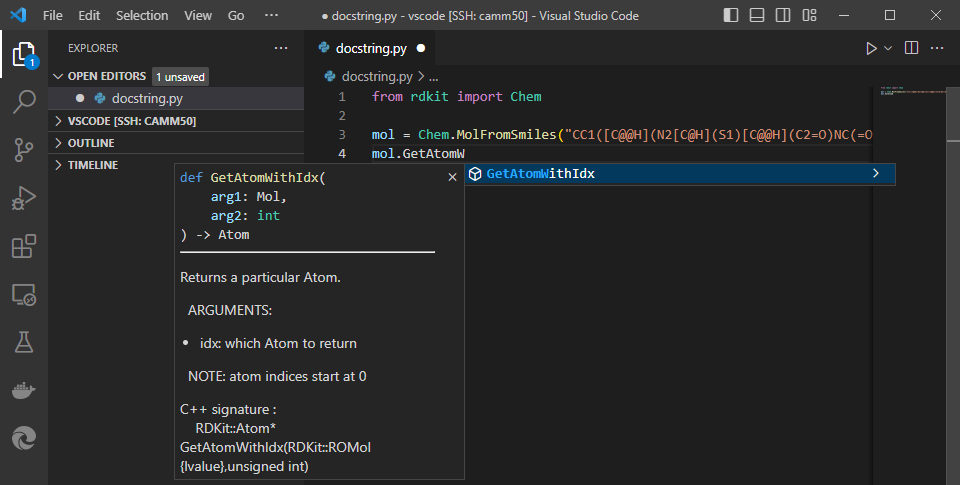
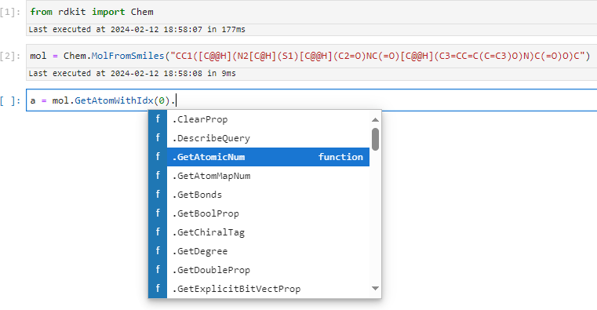

---
categories:
- documentation
- release
date: '2024-03-08'
title: A stub a day keeps the docstrings at bay
description: Improving python usability
layout: post
toc: true
image: images/blog/setting-up-a-cxx-dev-env2.png

---
This is a guest post by Paolo Tosco (GitHub: @ptosco), one of the RDKit core maintainers.

This blog post expands a bit on the topic I presented last year in Mainz during [a lightning talk](https://github.com/rdkit/UGM_2023/blob/main/Presentations/Tosco_A_stub_a_day_keeps_the_docstrings_at_bay.pdf) at the 2023 RDKit UGM, _i.e._, the generation of RDKit stubs and programmatic patching of existing Python docstrings.

## TL;DR

Starting with the 2023.09.6 release of the RDKit, the visibility and usability of the Python API documentation in VS Code is vastly improved. You now get things like this:



## Background

I have been annoyed for a while by the fact that, when writing RDKit Python scripts in [Visual Studio Code](https://code.visualstudio.com/) (I will it call VS Code from now on for simplicity), the familiar and helpful IntelliSense hints suggesting function or method names were either limited to a handful of functions or were not popping up at all.

For example, the `rdkit.Chem` module features a range of `MolFrom...` and `MolTo...` functions to generate an RDKit molecule from several formats and export an RDKit molecule to various formats, respectively.

However, when typing `mol = Chem.Mol` in VS Code, only InChI-related functions and `FindMolChiralCenters` were listed in the drop-down pop up:


Even after manually typing `Chem.MolFromSmiles`, VS Code would still not show any tooltip with the function docstring:



Things were working much better in Jupyter Lab, as the drop-down was being populated with the expected methods while typing:


Also class methods seemed to work as expected:


However, something was still not quite right, as Jupyter Lab was not able to figure out the methods for the `Atom` instance returned by the `Mol.GetAtomWithIdx` method, and the dropdown was not showing any of the expected `Atom` methods:


At some point I was sufficiently annoyed by all of the above that I decided to invest a bit of time in figuring out why it was happening. I learnt that VS Code hints are powered by [Pyright](https://microsoft.github.io/pyright/#/), which in turn requires [stubs](https://mypy.readthedocs.io/en/stable/stubs.html) to do its job, and RDKit does not have them. In the absence of stubs, the only available hints are those that can be obtained by introspection, which is the mechanism used by Jupyter Lab. In VS Code, introspection only works for functions defined in Python files, such as `FindMolChiralCenters` (`rdkit/Chem/__init__.py`) or InChI-related functions (`rdkit/Chem/inchi.py`). Since the large majority of RDKit functions and classes are defined in binary modules (_i.e._, files bearing a `.so`, `.dylib` or `.pyd` extension, depending on the platform), now we know why most of the RDKit API is unknown to VS Code.

Stubs are Python files (though with a different extension, `.pyi`) containing class and free function definitions; docstrings associated to classes and functions are also included as triple-quoted comments. Function and method signatures are usually associated with parameter types and return types. Types are used by static type checkers such as [`mypy`](https://mypy.readthedocs.io/en/stable/index.html), and by VS Code to figure out that the object returned by a function or class constructor is a class instance. Hovering on the object will show up the docstring associated to the class, and typing a dot after the object will trigger a pop up with all methods and properties available on that object. Once the user selects one of the available methods, VSCode will present a tooltip with the docstring associated to the method, as it had previously done with the class instance.<br>

This works great for Python modules that come with stubs:



Interestingly, Jupyter Lab seems to know that `re.compile` returns a `re.Pattern` instance, and presents us with the available methods, contrary to what happened with `Mol.GetAtomWithIdx`:



In summary, there seemed to be two different issues here:

1. The lack of stubs prevented hints from popping up in VS Code
2. Something else prevented correct introspection of the class method return type in jupyter Lab

## Generating stubs for RDKit

`Mypy` comes with a tool for automatic stub generation, [`stubgen`](https://mypy.readthedocs.io/en/stable/stubgen.html). Generating stubs for a Python package is super-simple:

```
$ stubgen -p rdkit
$ ls out/rdkit
Avalon  Chem  DataManip  DataStructs  Dbase  DistanceGeometry  ForceField  Geometry  __init__.pyi  ML  Numerics  rdBase.pyi  RDConfig.pyi  RDLogger.pyi  RDPaths.pyi  RDRandom.pyi  SimDivFilters  sping  TestRunner.pyi  utils  VLib
```

At first glance, `stubgen` seems to be able to process RDKIt's binary extension modules and generate stubs. However, upon closer inspection, it proves unable to extract types, parameters and docstrings. Therefore, the generated stubs are _really_ basic and not very useful, as they provide no hints about how to use the various functions and methods, nor any dosctrings:

```
$ grep -A3 MolFromSmiles -r out/rdkit
out/rdkit/Chem/rdmolfiles.pyi:def MolFromSmiles(*args, **kwargs) -> Any: ...
out/rdkit/Chem/rdmolfiles.pyi-def MolFromTPLBlock(boost) -> Any: ...
out/rdkit/Chem/rdmolfiles.pyi-def MolFromTPLFile(*args, **kwargs) -> Any: ...
out/rdkit/Chem/rdmolfiles.pyi-def MolFromXYZBlock(boost) -> Any: ...
```


Fortunately, there is another package, [`pybind11-stubgen`](https://pypi.org/project/pybind11-stubgen/), which does a much better job with RDKit's binary modules, and with a little bit of help can even figure out function parameters and types.
I wrote a small Python module, [`gen_rdkit_stubs`](https://github.com/rdkit/rdkit/tree/master/Scripts/gen_rdkit_stubs), which runs in parallel on multiple CPU cores and recursively generates stubs for the whole `rdkit` package in < 10s:

```
$ time ( python -m Scripts.gen_rdkit_stubs )

real    0m6.135s
user    1m51.786s
sys     0m27.283s
```

VS Code were now looking as they were supposed to, with all functions and methods populated in the dropdown pop-up, plus type hints and docstrings in the right place:


Also the `Mol` methods were being suggested, and VS Code seemed aware of the fact that `Mol.GetAtomWithIdx` returns an `Atom` instance:



However, the `Atom` methods were still not showing up, just as I had previously observed in Jupyter Lab:


A closer look at the stubs clarified that stubs were not quite correct yet: firstly, the `GetAtomWithIdx` method, as well as all of the `Mol` methods, were incorrectly decorated as `@staticmethod`; secondly, the `Atom` return type is not recognized, since the `Atom` object was not imported from `rdkit.Chem`, and hence is basically an unknown type:

```
$ grep -B1 'def GetAtomWithIdx' -r pybind11-stubgen_rdkit-stubs/
pybind11-stubgen_rdkit-stubs/Chem/rdchem.pyi-    @staticmethod
pybind11-stubgen_rdkit-stubs/Chem/rdchem.pyi:    def GetAtomWithIdx(arg1: Mol, arg2: int) -> Atom:
```

Manually correcting the stub to the following:

```
pybind11-stubgen_rdkit-stubs/Chem/rdchem.pyi-    #@staticmethod
pybind11-stubgen_rdkit-stubs/Chem/rdchem.pyi:    def GetAtomWithIdx(arg1: self, arg2: int) -> rdkit.Chem.Atom:
```

indeed led to the expected hints popping up:


In summary, there were three residual issues:

1. several hundreds of class method signatures in the C++ source code of RDKit Python wrappers were missing the `python::arg("self")` parameter, causing the corresponding methods to be incorrectly decorated as `@staticmethod`
2. `pybind11-stubgen` does not import objects used as return types; therefore, many return types are perceived as unknown by VS Code, and the associated class methods do not show up
3. functions and methods missing explicit `python::arg` parameters were attributed default parameter names such as `arg1`, `arg2`, ..., `argN`, which make many signatures rather obscure compared to their C++ counterparts which have more meaningful parameter names

It was immediately clear that manually patching the whole RDKit codebase to fix these 3 issues would be a daunting task.
Therefore, I explored ways to accomplish the same task programmatically, and the [Clang Indexing Library Bindings](https://libclang.readthedocs.io/en/latest/) emerged as the most appealing option.

The Clang Indexing Library can parse a C++ source file (including the headers that it references) and generate a tree-like structure which can be traversed to find the nodes of interest. Each of this nodes can in turn be related to a source code location (row and column numbers in the source file), making it possible to patch source code not just based on regular expressions, which would not be sufficient for our needs, but on some degree of actual "understanding" of the source code logic.

For this purpose, I wrote another Python module, [`patch_rdkit_docstrings`](https://github.com/rdkit/rdkit/tree/master/Scripts/patch_rdkit_docstrings), which:

1. identifies source code files which relate to Python wrappers and need patching
2. generates AST files for each source code file
3. traverses AST files to find the places in the source code that need patching
4. adds the `self` parameter where needed to avoid that class methods are incorrectly decorated as `@staticmethod`
5. replaces the `argN` parameter names in Python functions with more meaningful parameter names extracted from the C++ functions that the Python functions are wrapping
6. finally, runs `clang-format` on the patched sources to fix the formatting

Also `patch_rdkit_docstrings` runs in parallel to speed up the patching, which takes a few minutes. Since docstring patching is a one-off operation, speed is not a critical factor; however, it definitely was during the development of the module. In fact, `patch_rdkit_docstrings` required several iterations to have the source code properly patched, and being able to quickly evaluate progress made between iterations was very helpful.

Once Greg and I were happy with the source code patching made by `patch_rdkit_docstrings`, as well as with the stubs generated out of the patched source code by `gen_rdkit_stubs`, I submitted a [PR to RDKit with the programmatic source code patches made by `patch_rdkit_docstrings`](https://github.com/rdkit/rdkit/pull/6919/files).

The PR covered 91 files, with overall 4,076 lines of code being added and 1,088 being removed: definitely this was not a task that one would have liked to do manually: it would have probably required a comparable amount of time, some functions would have certainly being missed and some mistakes would have been made, and I would not have learnt anything about AST parsing and all the rest.


## Summary

Since Release 2023.09.4, after building and installing in the usual way RDKit libraries and Python modules, stubs can be built and installed with the following command:

```
cmake --build . --target stubs
```

or, on Linux and macOS platforms, running

```
make stubs
```

The stubs enable fully functional hints in VS Code:


As a bonus, thanks to the one-off source patching, also the Jupyter Lab issue described at the beginning is solved:



Finally, also [the online RDKit documentation](https://rdkit.org/docs/source/rdkit.Chem.rdchem.html#rdkit.Chem.rdchem.Mol.GetAtomWithIdx) looks prettier: `argN` parameters are replaced by meaningful parameter names taken from the respective C++ functions, while `self` parameters are now present in non-static methods:


Starting from Release 2023.09.6, `rdkit-stubs` are also available as part of `conda-forge` RDKit packages.

Happy coding with the new RDKit stubs!
